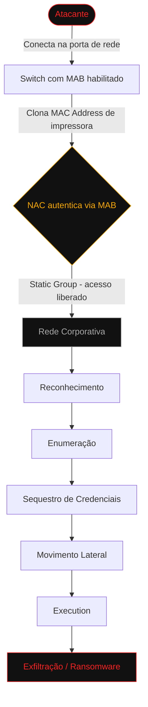
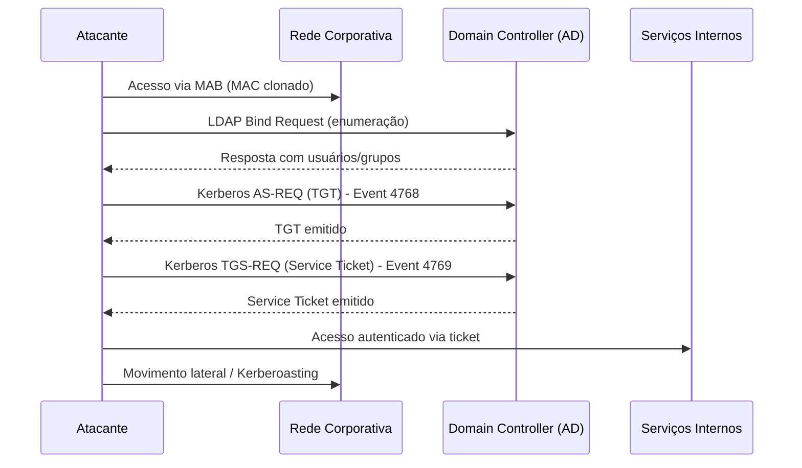
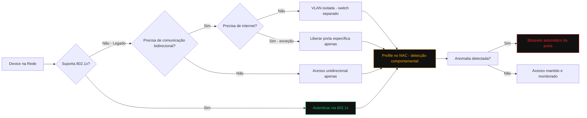

# TheCyberDefenseGuy
## Threat Hunting
### Hypothesis: Backdoor created after NAC solution deployment with MAB (MAC Address Bypass)

---

Antes do NAC: Network Owner tinha certeza que estava sem segurança de acesso a rede, deixava-te alerta a todo momento. Tudo era passível de investigação.

Depois do NAC: Network Owner passa a acreditar que está 100% seguro. Uma ferramenta, uma manobra, um budget. "Boom", tudo safe como deveria. Ao menos era o que falava o PPT do fabricante.

---

#### Histórico de Rede: Infraestrutura sem governança

Redes sem segmentação adequada, falta de gestão de identidade, endpoints sem hardening ou processo maduro de GPO seguindo boas práticas do CIS Benchmark, rede sem inventário, sem processo de mudança, sem CMDB, sem backup ou, se tiver backup, sem processo maduro de backup.

**Escopo do projeto:** Quero proteger meus ativos e garantir que somente devices conhecidos entrem na rede.

**Realidade:** Não conheço minha rede (Shadow IT), hubs, bridges, InterVlans, não existe segmentação de rede, e nem políticas de acesso restritivo via firewalls.

**Monitoramento:** Normalmente sem SIEM, ou sem ferramentas centralizadoras de logs. Mesmo com SIEM, sem saber o que procura, confiando apenas nos templates default da própria ferramenta. Sem entendimento do fluxo crítico da rede. Sem coleta de logs para análise e correlação caso aconteça um incidente.

**Pressão desde o primeiro dia de projeto:** Prazo apertado para entrega, orientações passadas pelo consultor sendo ignoradas drasticamente pelo simples fato: "faço depois, preciso entregar."

---

Era para ser um projeto de segurança, vira um projeto de rede. Aparecem os devices IoT (impressoras, catracas, câmeras, servidores e até mesmo máquinas que ainda não estão em compliance), acessando via MAB.

> **MAB não é solução, é manobra para devices legados:** nas entrelinhas, caso você tenha uma rede adequada para suportar esses devices, caso contrário está criando um backdoor na sua rede.

---

#### Superfície de Ataque

Imagina o seguinte: você adicionou um device na rede usando MAB, configurado de forma tradicional (Static Group). O ambiente entrou em produção; sua fábrica remota, ou escritório remoto, teve um acesso violado, simplesmente um funcionário mal intencionado, ou um terceiro, ou até mesmo uma ferramenta com acesso direto à internet foi conectada em uma porta de rede, abrindo um acesso legítimo para internet. Ou simplesmente o atacante clonando o MAC address de uma impressora.

Geralmente o tempo de abrir o chamado e a verificação via SLA por parte da TI já foi suficiente para: reconhecimento, enumeração, sequestro de credenciais, movimento lateral, execution e, dependendo do tipo de ataque, exfiltração e/ou criptografia de todos os dados da empresa.

Estou falando do básico: máquina maliciosa com a rede desorganizada, sem hardening, sem GPO, sem análise e correlação, sem equipes para investigar e testar pós-implementação ataques conhecidos.

---

#### Um pouco mais deep — Active Directory Credential Request

Requests for authentication credentials via Kerberos or other methods like NTLM and LDAP queries.

**Examples:**
- Kerberos TGT and Service Tickets (Event IDs 4768, 4769)
- NTLM Authentication Events
- LDAP Bind Requests

**Referências:**
- [MITRE ATT&CK - DC0084](https://attack.mitre.org/datacomponents/DC0084/)
- [Kerberoasting - Bureau Veritas](https://cybersecurity.bureauveritas.com/es/blog/kerberoasting-explotar-kerberos-para-comprometer-microsoft-active-directory)
- [Ataques de Kerberoasting no AD - Specops](https://specopssoft.com/es/blog/ataques-de-kerberoasting-en-active-directory/)

Uma vez na rede, depois de um backdoor desses, você expõe todo o resto — que poderia ter sido revisado e melhorado antes mesmo do NAC ser implementado. Um simples CIS Benchmark já diminuiria consideravelmente a superfície de ataque.

**Referência:** [CIS Benchmark - Microsoft Compliance](https://learn.microsoft.com/en-us/compliance/regulatory/offering-CIS-Benchmark)

---

#### Sugestão de Melhorias na Implementação de MAB

**Prefira sempre 802.1x:** muitos devices e softwares estão desatualizados na rede e alguns já suportam 802.1x em versões mais recentes.

Caso não suportar, siga um planejamento de isolamento dos devices em uma VLAN crítica, de preferência em um switch separado fisicamente dos devices 802.1x.

- Para devices que só recebem conexões: limitar acesso unidirecional apenas.
- Para serviços que precisam acessar a internet ou outros serviços dentro da rede: limitar apenas à porta específica. Para internet, se possível, não permitir acesso. Caso sejam necessárias atualizações, fazer de forma offline.
- Para devices que usam gestão na cloud: precisam entrar no processo de padronização de risco da organização, para não expor a empresa a um ataque de terceiros vindo da cloud.

**Utilize Profile:** Profile no NAC ajuda a criar gatilhos e atributos de segurança além do MAC address, com aprendizagem dinâmica e gatilhos de anomalias. Garante que se um device é desconectado e o MAC address é sequestrado/clonado, ao iniciar o acesso à rede, de acordo com o comportamento, a porta pode ser bloqueada pelo simples fato comportamental do endpoint.

---

#### Conclusão

O ponto aqui não é trazer a solução para todos os problemas, mas mostrar um risco real que vejo em cada implementação de NAC em que atuo ou opero no dia a dia.

Diminuir a superfície de ataque não significa que irá evitá-lo, mas sim atrasar ao máximo o atacante na movimentação e exploração da rede, aumentando a possibilidade de detecção e erradicação do mesmo.

---

*TheCyberDefenseGuy — Threat Hunting Series*
