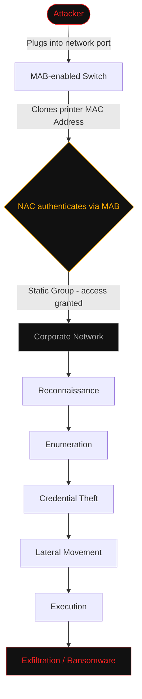
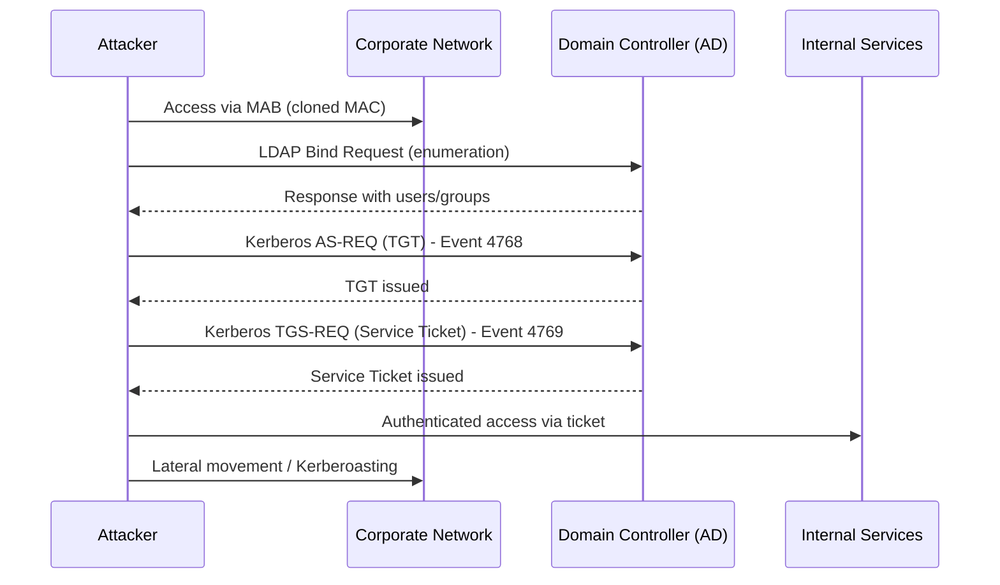
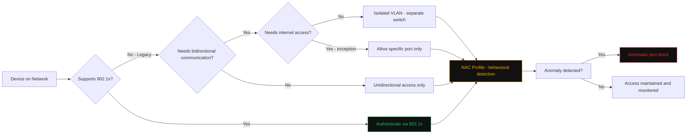

# TheCyberDefenseGuy
## Threat Hunting
### Hypothesis: Backdoor created after NAC solution deployment with MAB (MAC Address Bypass)

---

Before NAC: The Network Owner knew they had no access security in place. That kept them alert at all times. Everything was worth investigating.

After NAC: The Network Owner starts believing they are 100% secure. One tool, one move, one budget line. "Boom" — safe, just like it should be. At least that's what the vendor's slide deck said.

---

#### Network Background: Infrastructure without governance

Networks without proper segmentation, lack of identity management, endpoints without hardening or a mature GPO process following CIS Benchmark best practices, no network inventory, no change management process, no CMDB, no backup — or if there is a backup, no mature backup process to support it.

**Project scope:** I want to protect my assets and ensure only known devices access the network.

**Reality:** I don't know my own network (Shadow IT), hubs, bridges, InterVlans — there's no network segmentation, no restrictive access policies via firewalls.

**Monitoring:** Usually no SIEM, or no centralized log management tool. Even when a SIEM exists, there's no clear understanding of what to look for — relying solely on the tool's default templates. No understanding of the network's critical flow. No log collection for analysis and correlation in the event of an incident.

**Pressure from day one:** Tight delivery deadlines, consultant guidance being drastically ignored for one simple reason: "I'll fix it later, I need to ship."

---

What was supposed to be a security project turns into a network project. IoT devices start appearing — printers, access control gates, cameras, servers, and machines not yet in compliance — all accessing via MAB.

> **MAB is not a solution, it's a workaround for legacy devices:** the fine print is that it only works if your network is properly structured to support those devices. Otherwise, you're creating a backdoor in your own network.

---

#### Attack Surface

Picture this: you added a device to the network using MAB, configured the traditional way (Static Group). The environment went into production. Your remote factory or branch office had an access breach — a malicious insider, a third party, or even a tool with direct internet access plugged into a network port, opening a legitimate path to the internet. Or simply an attacker cloning a printer's MAC address.

By the time IT opens a ticket and runs through SLA verification, there's already been enough time for: reconnaissance, enumeration, credential theft, lateral movement, execution — and depending on the attack type, exfiltration and/or full data encryption.

I'm talking about the basics: a malicious machine on a disorganized network — no hardening, no GPO, no log analysis and correlation, no team to investigate and test known post-implementation attacks.

---

#### Going deeper — Active Directory Credential Request

Requests for authentication credentials via Kerberos or other methods like NTLM and LDAP queries.

**Examples:**
- Kerberos TGT and Service Tickets (Event IDs 4768, 4769)
- NTLM Authentication Events
- LDAP Bind Requests

**References:**
- [MITRE ATT&CK - DC0084](https://attack.mitre.org/datacomponents/DC0084/)
- [Kerberoasting - Bureau Veritas](https://cybersecurity.bureauveritas.com/es/blog/kerberoasting-explotar-kerberos-para-comprometer-microsoft-active-directory)
- [Kerberoasting attacks on AD - Specops](https://specopssoft.com/es/blog/ataques-de-kerberoasting-en-active-directory/)

Once inside the network, a backdoor like this exposes everything else — things that could have been reviewed and hardened before NAC was even deployed. A simple CIS Benchmark review would have already significantly reduced the attack surface.

**Reference:** [CIS Benchmark - Microsoft Compliance](https://learn.microsoft.com/en-us/compliance/regulatory/offering-CIS-Benchmark)

---

#### Recommendations for MAB Implementation

**Always prefer 802.1x:** many devices and software on the network are outdated, but some already support 802.1x in newer versions.

If 802.1x is not supported, plan to isolate those devices in a critical VLAN — preferably on a switch physically separate from 802.1x devices.

- For devices that only receive connections: restrict to unidirectional access only.
- For services that need internet or internal network access: limit to the specific required port only. For internet access, block it if possible. If updates are required, do them offline.
- For devices using cloud-based management: they must go through the organization's risk standardization process to avoid exposing the company to third-party attacks originating from the cloud.

**Use Profiles:** NAC Profiles help create security triggers and attributes beyond just the MAC address, with dynamic learning and anomaly-based triggers. If a device disconnects and the MAC address is hijacked or cloned, when it attempts to reconnect, the port can be blocked based purely on behavioral patterns from the endpoint.

---

#### Conclusion

The point here is not to present a solution to every problem, but to highlight a real risk I see in every NAC implementation I work with or operate on a daily basis.

Reducing the attack surface doesn't mean you'll prevent a breach — it means you'll delay the attacker's movement and exploitation of the network as long as possible, increasing the chance of detection and eradication.

---

*TheCyberDefenseGuy — Threat Hunting Series*
